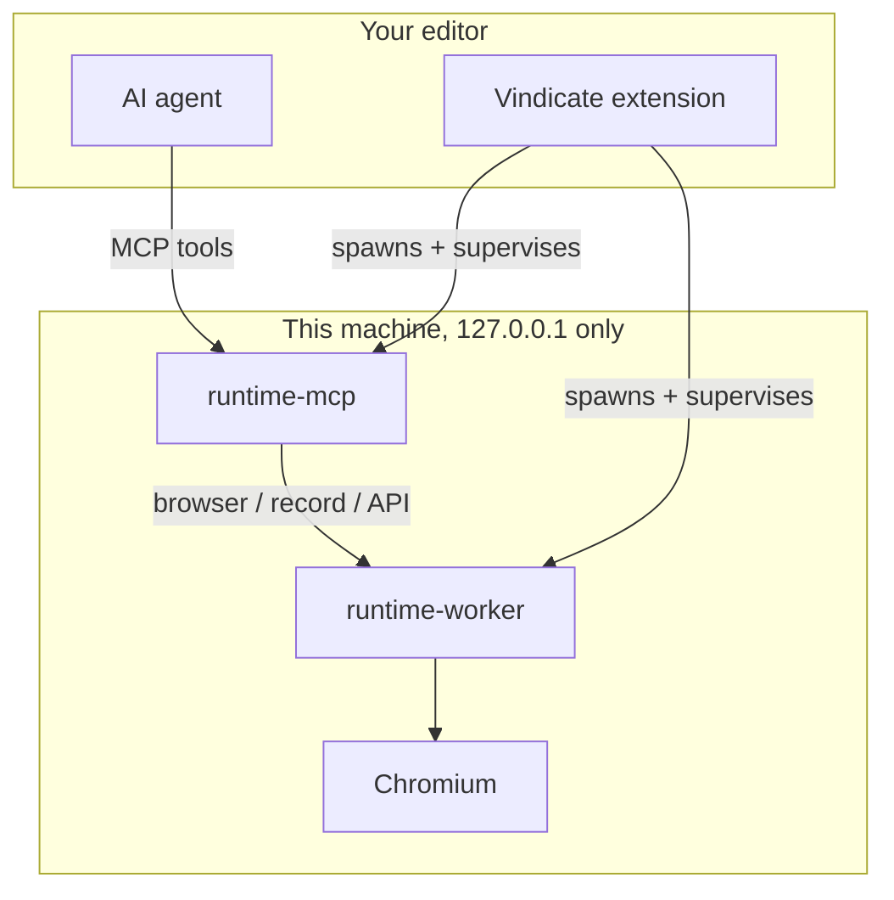

<div align="center">


# Vindicate Platform

**Autonomous quality for AI-native development teams.**

AI-native Playwright test automation for VS Code, Cursor, GitHub Copilot, Claude Code, and Antigravity.


</div>

## Architecture

Vindicate is a **stateless local stack**. The extension installs rules and skills, then your agent (Cursor, GitHub Copilot, Claude Code, or Antigravity) calls a local MCP server for workflow guidance, codegen, and browser tools. No cloud job machine, no MongoDB, no remote orchestration.



| Component                      | Role                                                      |
| ------------------------------ | --------------------------------------------------------- |
| **VS Code / Cursor extension** | Onboarding, dashboard, agent pairing, process supervisor  |
| **runtime-mcp**                | MCP server the agent talks to: workflow, codegen, tools   |
| **runtime-worker**             | Playwright browser sessions, recordings, and API requests |

`runtime-mcp` and `runtime-worker` are machine-wide singletons. Isolation between projects is per session, not per process. Full detail: [docs/ARCHITECTURE.md](docs/ARCHITECTURE.md).

## Workspace layout

```text
apps/
  runtime-mcp/       Local MCP server (workflow + codegen + tools)
  runtime-worker/    Playwright browser + recording worker
  vscode-extension/  VS Code / Cursor extension
  vindicate-ui/      Bundled MCP Apps panel UI
packages/
  protocol/          Shared Zod contracts
  config/            Shared configuration presets
  security/          Security policy and auth types
  observability/     Structured logging (Pino)
```

## Tooling

- Node.js `>=22`
- pnpm `>=10`
- Turborepo

## Common commands

From repository root:

```bash
pnpm lint
pnpm typecheck
pnpm test
pnpm build
```

Build the runnable apps:

```bash
pnpm turbo build --filter=@vindicate/runtime-mcp
pnpm turbo build --filter=@vindicate/runtime-worker
pnpm turbo build --filter=vindicate
```

## Docs

- [Architecture](docs/ARCHITECTURE.md)
- [Contributing](docs/CONTRIBUTING.md)
- [Security baseline](docs/SECURITY_BASELINE.md)
- [Supply-chain baseline](docs/SUPPLY_CHAIN_BASELINE.md)

## Changelog

See [CHANGELOG.md](CHANGELOG.md).

## License

Licensed under the [Apache License, Version 2.0](LICENSE).

## Contributors

<a href="https://github.com/OpenEvident/vindicate/graphs/contributors">
  
</a>
