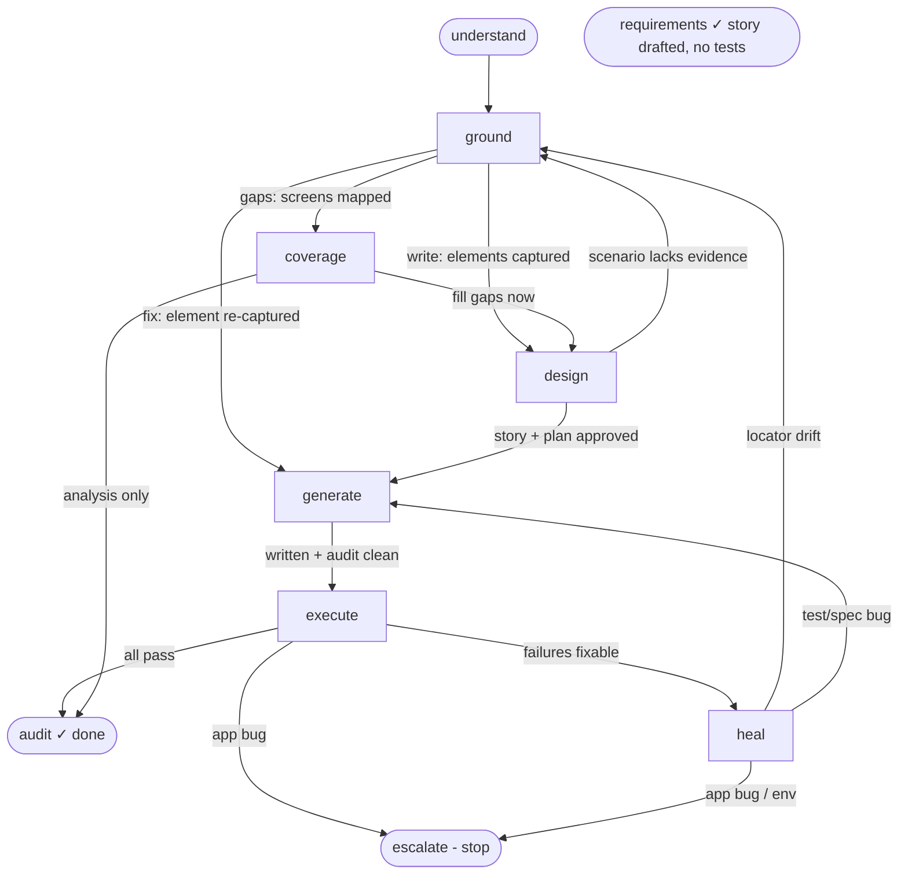

# Main graph — day-to-day test automation

Structured source: [`main.graph.json`](main.graph.json). This file documents the **served
representation** (D-010): the Mermaid map returned for orientation, the entry routing, and each
node's outgoing edges as explicit NL conditions.

## The universal loop

`understand → ground → design → generate → execute → heal → audit` (+ `coverage` for gaps,
`escalate` as a terminal outcome). Every path is a traversal/subset of this loop.

## Mermaid map (served by `vindicate_workflow()` / `vindicate_workflow(path)`)

## Entry routing (agent states the path)

| Path | Entry node | Why |
|------|-----------|-----|
| `write` | `understand` | new tests — draft the requirement first (story is approved later, in `design`, after exploring) |
| `fix` | `heal` | a known failure — diagnose first (mode: `failure-triage`) |
| `flaky` | `heal` | intermittent test — diagnose intermittency (mode: `flaky-triage`) |
| `refactor` | `design` | plan the restructure, then edit |
| `gaps` | `ground` | map screens (explore) before comparing to tests |
| `coverage` | `coverage` | read-only AC diff (stories ↔ specs) — no exploration |
| `smoke` | `execute` | just run existing tests against a URL |
| `requirements` | `requirements` | draft a requirements/story doc from a provided recording only — no exploration, no test generation |

`gaps` vs `coverage`: `gaps` explores the live app first (find untested screens), then diffs;
`coverage` is a pure stories-vs-specs AC report with no browser. Both end at `audit` (analysis) or
can branch into `design` to start filling gaps.

Crisp entry is deliberate — picking the wrong start node is the worst failure mode
(hallucinated entry point). The agent declares the path; the map routes it.

## Per-node outgoing edges (served with each node, incident style)

Each decision node lists ALL edges with mutually-exclusive, exhaustive conditions the agent
self-evaluates (D-013). The server soft-validates the chosen edge exists; it never blocks.

**understand** (modes: —)
- requirement drafted (story stays `draft`; approval happens in `design` after exploration) → **ground**

**ground** (modes: ai-explore · human-record · source-scan · recording-ingest · api-ingest)

  In `ai-explore`, **explore and record are two phases** — capture locators first, then (for a new
  story flow) reset and record a clean pass. `human-record` is the combined fallback when the AI can't
  drive the flow. `recording-ingest` consumes a **user-provided** recording as the grounding (no live
  exploration). `source-scan` seeds from in-repo app source. `api-ingest` (feature `layer == api`) reads
  an OpenAPI/Postman/curl/description source directly (no browser at all) and falls back to `api_request`
  only to fill a genuine information gap.
- `write` — required elements captured/validated (or ingested) → **design**
- `fix` — the failing element has been re-captured → **generate**
- `gaps` — screens mapped against the test inventory → **coverage**

**design** (modes: write-plan · refactor-plan)
- the story + test plan were approved by the user → **generate**
- an approved scenario has no captured locator evidence → **ground** (capture it, then return to `design`)

**generate** (modes: create · add_test_cases · register_page · direct-edit · create_api · add_api_test_cases · register_client)
- files written/edited and `npm run audit` is clean → **execute**

**execute** (modes: —)
- all targeted tests pass → **audit**
- failures that look fixable in-workflow → **heal**
- a failure is a genuine app bug (do NOT edit tests) → **escalate**

**heal** (modes: failure-triage · flaky-triage)
- root cause == locator drift (re-capture the element) → **ground**
- root cause == test/spec bug or flakiness (waits/races) — fix via direct edit or codegen → **generate**
- root cause == app bug or environment (stop + report) → **escalate**

  `flaky-triage` differs from `failure-triage`: detect *intermittency* (run N times, find
  races/missing waits) rather than reading a single deterministic failure.

**coverage** (modes: —)
- gap report produced, analysis only → **audit**
- user chose to fill gaps now (continue as write) → **design**

**audit** — terminal (done). Conformance check + summary panel.

**escalate** — terminal (stop + report). App bug / environment / blocked.

**requirements** — terminal (done). Drafts `.vindicate/stories/<feature>.story.md` from a recording only; no code.

## Notes on cycles
`execute → heal → {ground|generate} → execute` is an intentional cycle (the fix/re-run loop).
`design → ground → design` is the other intentional cycle: the write path explores first (against the
drafted story), approves the story in `design`, and loops back to `ground` whenever an approved
scenario still lacks captured locator evidence. Soft-validation permits both. The agent stops when
`execute → audit` (all pass) or a terminal node.

## Production scenarios — where each is covered (composition, not new nodes)

The graph is structurally complete for advanced production work: these are handled by **modes +
node content + rules**, NOT by adding nodes (D-008 — author phases well, let the agent compose).
Detailed how-to lives in the node content (authored under `nodes/`).

| Scenario | Covered by |
|---|---|
| SSO / MFA / complex login | `ground` (human-record or ai-explore handles login) + `generate` (storage-state / `auth.setup.ts`) |
| Multiple environments (staging/prod) | `.env` `BASE_URL` config; `ground`/`execute` use the configured URL — not a graph concern |
| iframes / Shadow DOM | locator rules (role_name for shadow DOM; iframes a known limitation) in `ground` capture + `generate` rendering |
| Mobile / responsive emulation | Playwright project config + `generate` content |
| File upload / download | `upload` action already in codegen schema; captured in `ground`, rendered in `generate` |
| Pure API testing (no browser) | feature `layer == api` — `ground` (`api-ingest` mode) + `generate` (resource clients/builders, `<feature>.api.spec.ts`) |
| Seeded backend data / API setup inside a UI test | feature `layer == hybrid` — both layers grounded independently, mixed spec via direct-edit after `create` (see `generate`) |
| Visual regression | `generate` (toHaveScreenshot assertions) — same loop, different assertion style |
| Accessibility (axe) | `generate` (inject + assert) via direct-edit |
| Journey tests across features | `ground` captures across pages; `generate` composes page objects |

Out of scope (not Playwright-E2E, not graph gaps): load testing, deep perf profiling, security scanning.

## Design-intent notes

- **Intent classification is the skill's job, not a graph node.** The L1 skill reads the user's
  request, picks the path, and calls `vindicate_workflow(path)`. On ambiguous intent ("help with my
  tests"), the skill instructs the agent to **ask which path**. `vindicate_workflow()` (no path)
  returns the map to aid classification.
- **Deleting / removing obsolete tests** = a direct edit; home is the `refactor` path (or plain
  direct-edit). No dedicated node.
- **Mid-workflow path switching** is allowed — one connected graph; soft-validation warns on an
  unusual `from→to` but never blocks, so the agent can legitimately go off the happy path.
