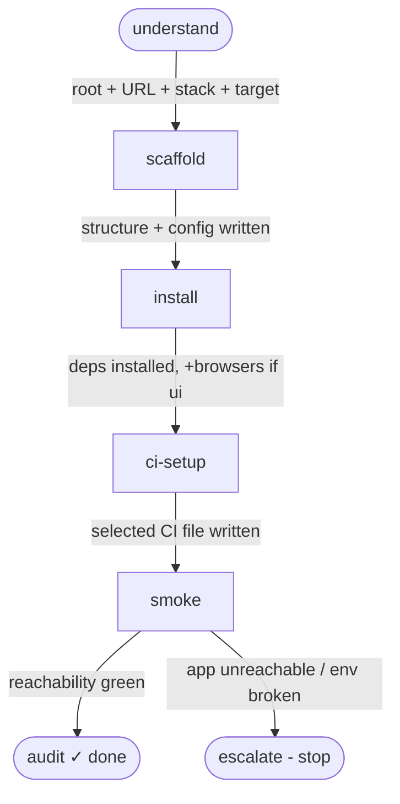

# Setup graph — bootstrap / CI

Structured source: [`setup.graph.json`](setup.graph.json). Used to stand up a new Vindicate
Playwright project and/or wire CI. Satisfies the bootstrap completion gate (C15) before any
`main`-graph test work begins.

> **Delivery note (reconciles with the single-skill decision).** Unlike `main` — whose nodes are
> served one at a time by `vindicate_workflow(node)` — **setup is delivered as ONE skill**
> ([`../nodes/setup.md`](../nodes/setup.md)), because bootstrap is short, linear, and gate-driven.
> `vindicate_workflow(path="bootstrap")` and `vindicate_workflow(path="ci")` both return the whole setup
> skill (mode-sliced: `bootstrap` runs the full arc, `ci` runs the CI step only). The nodes below are
> therefore the **internal step sequence the single skill follows** — a structural reference and the
> source for soft-validation/ordering, _not_ separately-served node packs. `understand`/`scaffold`/
> `install`/`ci-setup`/`smoke`/`audit` map onto the numbered Steps in `setup.md`; `escalate` is the
> shared stop-and-report outcome.

## Mermaid map

## Entry routing

| Path        | Entry node   | Why                                                 |
| ----------- | ------------ | --------------------------------------------------- |
| `bootstrap` | `understand` | full project stand-up                               |
| `ci`        | `ci-setup`   | only add/fix the CI workflow on an existing project |

## Per-node outgoing edges

**understand** — project root, app URL, stack, and target (`ui`/`api`/`both`) confirmed → **scaffold**

**scaffold** — folder structure + config files + `BasePage` and/or `BaseApiClient` + barrels written for the resolved target (`scaffold_project`) → **install**

**install** — dependencies installed, plus Playwright browsers only when target includes `ui` (an `api`-only project never launches one) → **ci-setup**

**ci-setup** — user-confirmed CI file written (GitHub: `.github/workflows/vindicate-tests.yml`; Bitbucket: `bitbucket-pipelines.yml`) (C14) → **smoke**

**smoke**

- a reachability test runs green against `BASE_URL` → **audit**
- the app is unreachable or environment is broken → **escalate**

**audit** — terminal (done). Verifies the C15 bootstrap gate is satisfied.

**escalate** — terminal (stop + report).

## Handoff to `main`

After `setup` completes (audit ✓), day-to-day work uses the [`main`](main.graph.md) graph.
Bootstrap is a one-time arc; it does not loop.
