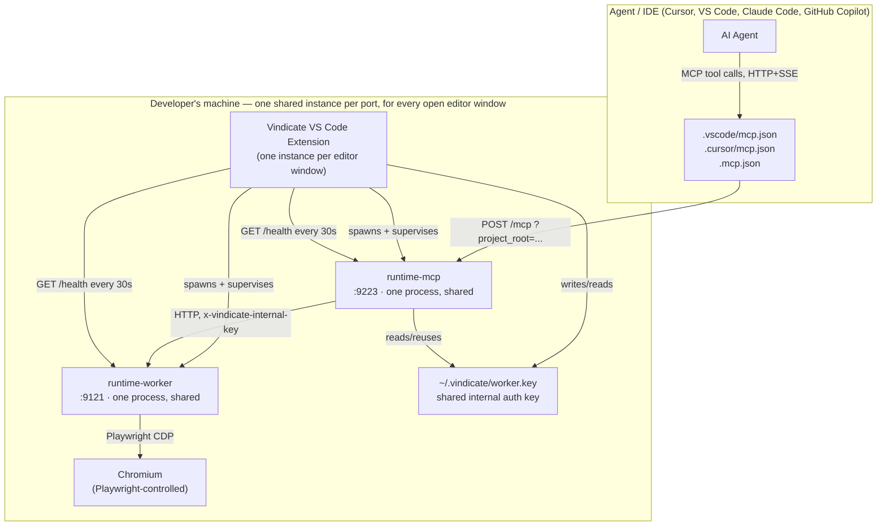
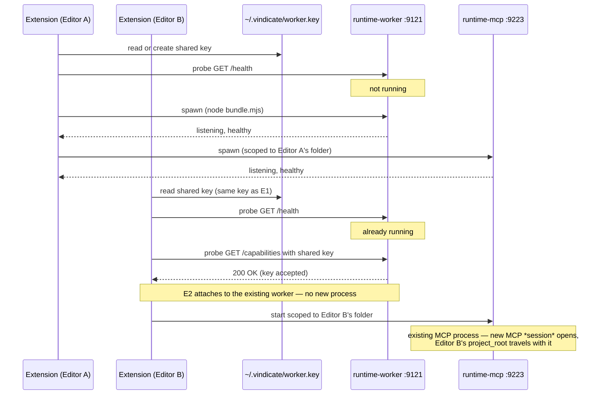

# Vindicate Architecture

> This document describes what the system actually does today — not the intended future state.
> Where behavior may change, that is called out explicitly rather than assumed.

## 1. What Vindicate is

Vindicate is an AI-agent-driven Playwright test automation toolkit. It has three runtime
components, all running **locally on the developer's machine** — no cloud service involved:

| Component                       | What it is                                                                                                                                                   | Lives in                |
| ------------------------------- | ------------------------------------------------------------------------------------------------------------------------------------------------------------ | ----------------------- |
| **Vindicate VS Code Extension** | The UI, onboarding, and process supervisor. Works in VS Code and Cursor (both are VS Code forks).                                                            | `apps/vscode-extension` |
| **runtime-worker**              | A local HTTP daemon that drives a real Chromium browser via Playwright — sessions, actions, snapshots, recordings.                                           | `apps/runtime-worker`   |
| **runtime-mcp**                 | A local MCP (Model Context Protocol) server. This is what the AI agent (Cursor, Claude Code, GitHub Copilot, etc.) actually talks to as "Vindicate's tools." | `apps/runtime-mcp`      |

The extension does not do test automation itself — it **spawns and supervises** the other two local
processes, and writes the config files that tell an agent's IDE how to reach `runtime-mcp`. The
actual automation work happens in `runtime-worker` (browser control) and is _orchestrated_ by
`runtime-mcp` (the tool surface + workflow guidance the agent calls).

## 2. System overview



**Key structural fact:** `runtime-worker` and `runtime-mcp` are **machine-wide singletons**, not
one-per-editor-window. If you have Cursor and VS Code open on two different projects at once, both
editors' extension instances share the _same_ `runtime-worker` (port 9121) and the _same_
`runtime-mcp` (port 9223) process. Isolation between projects happens at the _session/request_
level, not the process level (see §5 and §6).

## 3. Component responsibilities

### 3.1 Vindicate VS Code Extension (`apps/vscode-extension`)

- Handles onboarding UI, the dashboard/sidebar/panel webviews, and file-watching for project health
  metrics.
- **Spawns and supervises** `runtime-worker` and `runtime-mcp` as local child processes
  (`WorkerManager` / `McpManager`, both extending `BaseProcessManager`), coordinated by
  `RuntimeLifecycle`.
- Detects installed AI tools (`ToolDetector`: Cursor, VS Code/Copilot, Claude Code) and writes the
  config files each tool needs to discover Vindicate's MCP server (§7).
- Runs entirely client-side — every extension instance (each open editor window, and each separate
  app like Cursor vs. VS Code) runs its own copy of this code, but they coordinate through the
  shared worker/MCP processes and the shared key file rather than owning their own.

Activation sequence (`extension.ts` → `boot.ts`):

1. Construct services (config writers, file watcher, health ping, etc.).
2. Resolve the open workspace folder.
3. `RuntimeLifecycle.start(folderPath)` — unconditionally spawns/attaches to `runtime-worker`, then
   (if a folder is open) `runtime-mcp`. No gating: local services start as soon as the extension
   activates.
4. Subscribe to workspace-folder-change events to restart `runtime-mcp` scoped to the new folder
   (`restartForFolder`) without touching the shared worker.

### 3.2 runtime-worker (`apps/runtime-worker`)

A Fastify HTTP server on **port 9121**. Owns all real browser interaction via Playwright.

- **Session lifecycle**: `POST /sessions` creates a browser context; sessions move through a state
  machine — `active → paused → dead → expired → closed` (`session.state-machine.ts`). Each session
  is stamped with a `project_root` at creation time and persisted to disk
  (`~/.vindicate/...` session store), so it survives worker restarts within the TTL.
- **Commands**: `POST /sessions/:id/commands` — the actual browser actions (navigate, click, type,
  snapshot, assert, etc.) stream results back over Server-Sent Events.
- **Recording**: start/stop/finalize/discard a recorded interaction session, producing a JSON
  recording artifact under `<project_root>/.vindicate/recordings/`.
- **Session-scoped file I/O**: `/sessions/:id/files/*` (read/write/list/delete) — the path is
  resolved against **that session's own `project_root`**, not a process-wide setting. This is what
  makes it safe for one worker process to serve sessions from several different projects at once.
- **Logs**: per-session console logs, network logs, and an action log for debugging.
- **Health / capabilities**: `GET /health`, `GET /ready`, `GET /capabilities`, `POST /shutdown`.
- **Resource governor**: samples CPU/memory and can throttle or reject new work under pressure.
- **Idle self-shutdown**: since one worker now serves every editor, nothing else tells it to stop
  when the last editor closes. It exits itself after `VINDICATE_IDLE_SHUTDOWN_MS` (default 5
  minutes) with no `/health` pings **and** zero active/paused sessions.
- Every non-`/health`/`/ready` route requires the `x-vindicate-internal-key` header to match the
  worker's configured key (§5).
- **API automation**: `POST /api-request` — a single, stateless HTTP request (no browser session
  involved) used as a fallback/gap-filler when grounding an API spec or diagnosing a failed API
  test. Runs alongside, not instead of, the Playwright-based UI automation above.

### 3.3 runtime-mcp (`apps/runtime-mcp`)

A Fastify HTTP server on **port 9223** hosting an MCP (`@modelcontextprotocol/sdk`)
`StreamableHTTPServerTransport` at `POST /mcp`. This is the process AI agents actually connect to.

- **Stateless between tool calls** by design — no job state is held in the MCP process itself; the
  generated `.ts` files, recordings, and `.vindicate/` files on disk are the source of truth.
- **One session per MCP client connection**, each bound to the `project_root` supplied by that
  client at `initialize` time (query string primary, `x-vindicate-project-root` header fallback) —
  see §6. This is how one shared MCP process correctly serves several different projects/windows at
  once without cross-contaminating file I/O.
- **Proxies browser/recording operations to `runtime-worker`** over HTTP via `WorkerClient`, which
  wraps calls with a circuit breaker (`healthy` → `degraded` → `down`) and retry/backoff.
- **Serves the workflow content bundle** (`vindicate_workflow` tool) — a graph of guidance nodes
  that steers the agent through the test-automation lifecycle (§8).
- **Codegen**: `vindicate_generate_code` writes/edits page objects and specs directly to disk
  (files-as-truth; no schema round-trip). Covers two parallel tracks: UI modes (`validate`,
  `create`, `add_test_cases`, `register_page`) generate Playwright page objects/specs from
  `browser_read` locators; API modes (`validate_api`, `create_api`, `add_api_test_cases`,
  `register_client`) generate resource clients/builders/`expected.json`/auth fixtures from
  endpoint shapes gathered during `ground`'s `api-ingest` step (via the `api_request` tool, §3.2).
- **Scaffolding**: `scaffold_project` writes the initial project structure, CI workflow file
  (GitHub Actions or Bitbucket Pipelines), and config.

## 4. Process lifecycle — spawn, attach, and share



**What changed to make this work (and why it matters operationally):** every editor previously
generated its **own random internal key** in VS Code's per-editor secret storage. That is not
shared across editor apps or profiles, so a second editor opening while a worker from the first was
still running would always collide ("a runtime worker is already listening... with a different
internal key"). The key is now stored in a single file, `~/.vindicate/worker.key` (created once,
`0600` permissions, atomic create so two simultaneous first-launches can't race into two different
keys) — so every editor, on every profile, on every app, reads the same key and can always attach
to whatever worker is already running.

**Consequences of the shared-singleton model:**

- Opening multiple projects at once, in multiple editors/apps at once, or closing and reopening an
  editor later — all just attach to the already-running worker/MCP rather than erroring or spawning
  duplicates.
- Closing one editor window **does not** kill the shared worker (that would break every other open
  editor). The worker's lifetime is governed by its own idle self-shutdown (§3.2) instead.
- If two editors happen to launch at the exact same moment and both attempt to spawn (a genuine
  race), the loser detects its own spawn failed, re-probes, and attaches to the winner instead of
  surfacing an error.

## 5. Internal request authentication

There is exactly one auth mechanism in this system — **no cloud account, no sign-in, no user
identity anywhere**. It exists purely to stop arbitrary local processes or web pages from driving a
locally-listening automation daemon (e.g. CSRF from a browser tab hitting `localhost:9121`):

- A 32-byte hex value is generated once and stored in `~/.vindicate/worker.key`.
- It is sent as the `x-vindicate-internal-key` header on every request to `runtime-worker` (and used
  by `runtime-mcp` itself when it talks to the worker).
- It proves the request originated from this machine's own Vindicate installation — nothing more.
  It carries no user identity and gates nothing product-level.

The MCP server's own `/mcp` endpoint (what the agent connects to) is **not** gated by the internal
key — only the worker's HTTP API and the MCP-to-worker link are.

## 6. Multi-project isolation — how one shared server stays safe

Because `runtime-worker` and `runtime-mcp` are shared singletons, correctness depends entirely on
**identity traveling with each request/session, never with the process**:

- The extension writes each project's MCP config with its own absolute folder baked into the URL:
  `http://127.0.0.1:9223/mcp?project_root=<absolute path>` (query string primary; the
  `x-vindicate-project-root` header is a secondary channel some MCP clients don't forward).
- `runtime-mcp` builds a **fresh `McpServer` + `ProjectFs` instance per client session**, bound to
  that session's `project_root`. All file reads/writes/codegen/tests for that session are scoped to
  that folder — never to whichever project a _different_ window happens to be using.
- Browser sessions created through `browser_session` carry `project_root` in the create-session
  payload; `runtime-worker` stores it on the session record and every later file/recording
  operation for that session reads it back from there — not from any worker-level setting.
- The one config value that _isn't_ per-session, `VINDICATE_PROJECT_ROOT`, only affects a legacy
  fallback path used by clients with no workspace concept (Claude Desktop, prior to its removal
  from the onboarding flow); real IDE clients always supply an explicit `project_root`.

The agent itself never sees or sets `project_root` — it isn't a tool parameter. It's entirely a
connection-level property the extension wires into the MCP URL when it writes the config file.

## 7. Config files the extension writes per project

Written on demand as the user pairs an agent in onboarding (`vindicate.confirmTools`) or via the
Config tab. All are additive/idempotent — re-running does not clobber existing entries.

| Tool                     | File                              | Format                                                          |
| ------------------------ | --------------------------------- | --------------------------------------------------------------- |
| Cursor                   | `.cursor/mcp.json`                | `{ mcpServers: { Vindicate: { url, headers } } }`               |
| Cursor                   | `.cursor/rules/vindicate.mdc`     | Cursor project rule                                             |
| Cursor                   | `.cursor/skills/<skill>/SKILL.md` | Agent skill                                                     |
| VS Code / GitHub Copilot | `.vscode/mcp.json`                | `{ servers: { Vindicate: { type: "http", url, headers } } }`    |
| VS Code / GitHub Copilot | `.github/copilot-instructions.md` | Marker-delimited Vindicate block                                |
| Claude Code              | `.mcp.json`                       | `{ mcpServers: { Vindicate: { type: "http", url, headers } } }` |
| Claude Code              | `CLAUDE.md`                       | Vindicate project instructions                                  |
| Claude Code              | `.claude/skills/<skill>/SKILL.md` | Agent skill                                                     |

`url` is always `http://127.0.0.1:9223/mcp?project_root=<workspace folder>`; `headers` carries
`x-vindicate-project-root` as a fallback channel.

## 8. The workflow content system (`vindicate_workflow`)

`runtime-mcp` ships a bundled content graph (`apps/runtime-mcp/content/`) that the agent navigates
via the `vindicate_workflow` tool to get phase-specific guidance instead of one giant system prompt.

- **Graphs** (`content/graphs/*.graph.json`) define nodes and the edges between them. The `main`
  graph is the day-to-day test-automation loop:

  ```mermaid
  flowchart LR
      understand --> ground --> design --> generate --> execute
      execute --> audit
      execute --> heal
      execute --> escalate
      heal --> ground
      heal --> generate
      heal --> escalate
      ground --> coverage
      coverage --> audit
      coverage --> design
  ```

  A separate `setup` graph covers first-time project bootstrap and CI wiring.

- **Nodes** (`content/nodes/*.md`) are the actual guidance markdown the agent reads at each phase,
  with YAML frontmatter declaring the node's graph, valid modes, and which **refs** to append.
- **Refs** (`content/refs/*.md`) are shared reference material (conformance contract, page-object
  conventions, recipes, memory-file layout) appended to a node's body based on frontmatter — kept
  separate so multiple nodes can share the same source of truth instead of duplicating it.
- Entry points (`write`, `fix`, `flaky`, `refactor`, `gaps`, `coverage`, `smoke`, plus `bootstrap`/
  `ci` for setup) route the agent to the right starting node for the task at hand.

## 9. MCP tool surface

Registered in `mcp-server.ts` (`apps/runtime-mcp/src/mcp/tools/`):

| Category          | Tools                                                                                                                                                                      |
| ----------------- | -------------------------------------------------------------------------------------------------------------------------------------------------------------------------- |
| Workflow          | `vindicate_workflow`, `vindicate_validate_story`, `vindicate_ask_user`, `vindicate_design`, `vindicate_show_panel`                                                         |
| Codegen / project | `vindicate_generate_code` (UI + API modes), `scaffold_project`, `run_tests`                                                                                                |
| Browser           | `browser_session`, `browser_navigate`, `browser_read`, `browser_act`, `browser_assert`, `browser_diagnose` (optional, flag-gated)                                          |
| API               | `api_request` — stateless single-request fallback/gap-filler, mirrors `browser_diagnose`'s role for UI                                                                     |
| Recording         | `browser_record_start`, `browser_record_finalize`, `browser_record_discard`, `browser_record_list`, `browser_record_read`, `browser_record_annotate`, `browser_record_get` |

`browser_diagnose` is gated by `VINDICATE_VISUAL_DIAGNOSIS` (default on) — a kill switch, not a
per-user setting.

## 10. Ports and protocols

| Component        | Port   | Protocol                                                             | Auth                                                             |
| ---------------- | ------ | -------------------------------------------------------------------- | ---------------------------------------------------------------- |
| `runtime-worker` | `9121` | HTTP + SSE (Fastify)                                                 | `x-vindicate-internal-key` header                                |
| `runtime-mcp`    | `9223` | HTTP (MCP Streamable HTTP transport) at `/mcp`; plain HTTP elsewhere | none on `/mcp`; internal key for its own calls out to the worker |

All local ports are bound to `127.0.0.1` only — never exposed on the network. There is no cloud
component in this system at all.

## 11. Known operational characteristics

- **No supervised auto-restart.** If either process crashes, nothing currently restarts it
  automatically; the extension's health ping (`GET /health` every 30s) will show it as down, and the
  user must reload the editor window or otherwise trigger a respawn. Both processes now install
  `unhandledRejection`/`uncaughtException` handlers so a stray rejection logs and keeps the process
  alive instead of silently dying (previously the most common real-world cause of unexpected
  crashes mid-task).
- **First run after this shared-key change requires a clean restart.** Any worker process spawned
  by a pre-update extension is using the old per-editor key scheme and will not be recognized by an
  updated extension; a full editor quit (not just "Reload Window") clears it. One-time only.
- **Multi-root workspaces**: Vindicate uses only the first folder in a multi-root VS Code workspace;
  a warning is logged if more than one is present.
- **Claude Desktop is not currently supported** as an onboarding/pairing target (removed; it has no
  workspace concept, which doesn't fit the per-session `project_root` model).

## 12. Where to look in the repo

```
apps/vscode-extension/src/extension/processes/   WorkerManager, McpManager, RuntimeLifecycle
apps/vscode-extension/src/extension/config/      MCP_TARGETS.ts, ToolDetector, per-tool config writers
apps/runtime-worker/src/services/browser/        session store, commands, recording, snapshots
apps/runtime-worker/src/services/api-request/    stateless HTTP request handler (api_request tool)
apps/runtime-worker/src/core/                    config, governor, idle-shutdown, shutdown
apps/runtime-mcp/src/mcp/                         MCP server, tools, session multiplexing
apps/runtime-mcp/src/worker/                      WorkerClient (HTTP client to runtime-worker)
apps/runtime-mcp/content/                         workflow graphs, nodes, refs (agent guidance)
packages/protocol/                                 shared Zod schemas/types between mcp and worker
```
